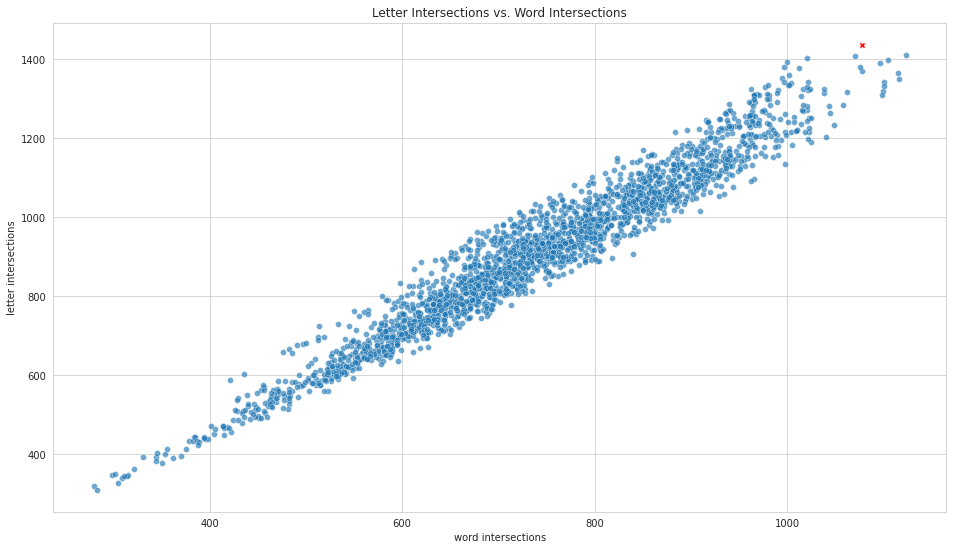

# Wordle Solver

This is a quick Wordle solver I came up with. The idea is as follows:

- First, the initial guess is always the word "slate". The reason for this can be seen in the following picture:


The word 'slate' corresponds to the red 'x' in the above plot. It has the highest number of letter intersections with other words in the answer pool, and so this first guess has the highest probability of intersecting the hidden word (for example, 'slate' and 'train' intersect at the 'a'). It also has one of the highest number of intersections with other words in general.

- Once the initial guess 'slate' is made, Wordle returns a hint. We cut the answer pool down to only words that agree with the hint. Out of this new answer pool, we find the word which has the highest number of letter intersections with other words in this new answer pool. This is the next guess.

- ... Repeat until we only have a single guess left. This is the answer. 

### Performance
This performs surprisingly well. Here are some statistics:

| Left columns  | Right columns |
| ------------- |:-------------:|
| initial guess      | 'slate'     |
| average guesses     | 3.686     |
| hardest word      | 'joker' (8 guesses)     |
| win rate      | 99.35%     |

Here is the guess distribution for 'slate':

| No. Guesses  | Occurences |
| ------------- |:-------------:|
| 1      | 1     |
| 2      | 146 |
| 3      | 854 |
| 4      | 972 |
| 5      | 279 |
| 6      | 48 |
| 7      | 12 |
| 8      | 3 |

### Usage

You can call these functions in a Jupyter notebook. With an .ipynb in the same directory as wordle_solver.py, you can import these tools via:
```
from wordle_solver import *
words = WordList(wordle_small)
wordle = Wordle(answer_pool=words)
```
Here, wordle_small is the small answer pool, containing 2315 words. There is also wordle_big, which contains about 13,000 words. You can get the guess path for a given initial guess and solution via the method:
```
wordle.simulate(initial_guess='slate', 
                solution='joker', 
                scheme='char_intersects', 
                show_guess_path=True)
```
which outputs:
```
slate -> fever -> cider -> power -> boxer -> goner -> homer -> joker
8
```
The 'scheme' is the parameter which determines how potential guesses are ranked. As mentioned above, the main and most effective choice is via letter intersections with other words in the active answer pool. To simulate an initial guess against the entire answer pool, call:
```
wordle.full_simulation(initial_guess='slate', 
                       scheme='char_intersects', 
                       show_guess_path=False)
```
This generates the statistics above. 