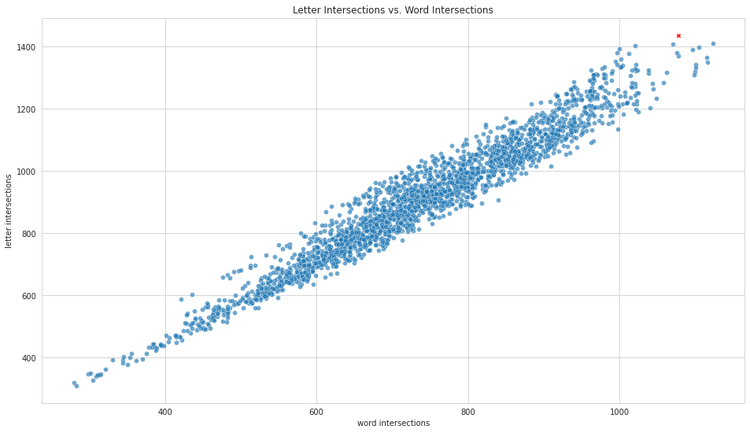

# Wordle Solver

This is a quick Wordle solver I came up with. The idea is as follows:

- First, the initial guess is always the word "slate". The reason for this can be seen in the following picture:


The word 'slate' corresponds to the red 'x' in the above plot. It has the highest number of letter intersections with other words in the answer pool, and so this first guess has the highest probability of intersecting the hidden word (for example, 'slate' and 'train' intersect at the 'a'). It also has one of the highest number of intersections with other words in general.

- Once the initial guess 'slate' is made, Wordle returns a hint. We cut the answer pool down to only words that agree with the hint. Out of this new answer pool, we find the word which has the highest number of letter intersections with other words in this new answer pool. This is the next guess.

- ... Repeat until we only have a single guess left. This is the answer. 

### Performance
This performs surprisingly well. Here are some statistics:

| Statistic       |        Value        |
| --------------- | :-----------------: |
| initial guess   |       'slate'       |
| average guesses |        3.686        |
| hardest word    | 'joker' (8 guesses) |
| win rate        |       99.35%        |

Here is the guess distribution for 'slate':

| No. Guesses | Occurences |
| ----------- | :--------: |
| 1           |     1      |
| 2           |    146     |
| 3           |    854     |
| 4           |    972     |
| 5           |    279     |
| 6           |     48     |
| 7           |     12     |
| 8           |     3      |

### Usage

You can call these functions in a Jupyter notebook. With an .ipynb in the root directory, you can import and run these tools via:
```
from src.wordle import (
    WordleSimulator,
    WordleSolver
)

solver = WordleSolver()
simulator = WordleSimulator()
simulator.full_simulation(solver)
```
This returns the `DataFrame` containing information which can be aggregated to the above statistics.

### Evolve.py

I also created an evolutionary algorithm to try to improve the average number of guesses. The idea is to assign a weight to each letter to adjust how much it is considered when ranking guesses. This produced some minor improvements to the solver. The evolutionary algorithm can be run via:
```
from src.evolve import (
    EpochHandler,
    Population
)

evo = EpochHandler()
evo.run_epochs(
    number_of_epochs=50, 
    cutoff_number=10, 
    population=Population.from_random(30, 'slate'), 
    answer_pool=ANSWER_POOL
)
```

The (current) "apex" solver has the following weights/genes:

```
{
    "a": 0.4016349200033334,
    "b": 0.44700069379062907,
    "c": 0.40306313012870937,
    "d": 0.8183019621306092,
    "e": 0.42344463146318084,
    "f": 0.5992886805643407,
    "g": 0.3779176240058469,
    "h": 0.527528683952443,
    "i": 0.6719525536780588,
    "j": 0.45105890801936543,
    "k": 0.45304930033789537,
    "l": 0.4101471991728201,
    "m": 0.6803555497284274,
    "n": 0.6942476449667149,
    "o": 0.3333891652172295,
    "p": 0.6419996088905393,
    "q": 0.2986341476877176,
    "r": 0.5571286378354326,
    "s": 0.44159906213412126,
    "t": 0.35670928435601407,
    "u": 0.419899287904584,
    "v": 0.6067549621986005,
    "w": 0.5202499412533375,
    "x": 0.40336629220874815,
    "y": 0.5413363063221512,
    "z": 0.4837416835960076,
}
```
which can be passed to the `weights` parameter when instantiating a solver. This particular solver has the following stats:

| Statistic       |        Value        |
| --------------- | :-----------------: |
| initial guess   |       'slate'       |
| average guesses |        3.662        |
| hardest word    | 'boxer' (9 guesses) |
| win rate        |       99.43%        |

| No. Guesses | Occurences |
| ----------- | :--------: |
| 1           |     1      |
| 2           |    146     |
| 3           |    899     |
| 4           |    941     |
| 5           |    261     |
| 6           |     54     |
| 7           |     10     |
| 8           |     2      |
| 9           |     1      |

Very minor improvement. Overall this new solver improved on 572 words, and got worse on 501 words.
